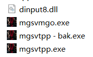
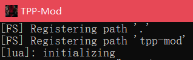

# Tutorials about MGSV:TPP custom server

<!-- vscode-markdown-toc -->
* 1. [How to connect a custom server rather than Konami's server ?](#HowtoconnectacustomserverratherthanKonamisserver)
	* 1.1. [Use hex editor to edit mgsvtpp.exe](#Usehexeditortoeditmgsvtpp.exe)
	* 1.2. [Use tpp-mod (recommend)](#Usetpp-modrecommend)
		* 1.2.1. [Compile the tpp-mod by yourself](#Compilethetpp-modbyyourself)
* 2. [How to set up my own server ?](#Howtosetupmyownserver)

<!-- vscode-markdown-toc-config
	numbering=true
	autoSave=true
	/vscode-markdown-toc-config -->
<!-- /vscode-markdown-toc -->

##  1. <a name='HowtoconnectacustomserverratherthanKonamisserver'></a>如何连接一个自定义服务器而不是科乐美的官方服务器 ?

###  1.1. <a name='Usehexeditortoeditmgsvtpp.exe'></a>用 16 进制编辑器修改 mgsvtpp.exe


把这里的网址改成你要连接的那台服务器的 ip 地址

 ```
 例如 : https://http://26.104.88.212:80/tppstm/gate
 ```

**注意 : 在你修改 exe 文件的时候不要把原有的二进制地址破坏了, 不然游戏会无法启动**

###  1.2. <a name='Usetpp-modrecommend'></a>使用 tpp-mod (强烈推荐)

首先下载这个 dll 文件 : [dinput8.dll](https://github.com/MXYLR/MXYLR.github.io/blob/master/MGSV-TPP-Server/dinput8.dll)

然后 `dinput8.dll` 放到游戏文件夹 :

```
例如我的幻痛安装在这个文件夹 : G:\SteamLibrary\steamapps\common\MGS_TPP
```



然后把下列指令写到 steam 游戏的启动选项里 :

```
".\mgsvtpp.exe" -custom-server http://[自定义服务器的 ip]/tppstm/gate
```

你也可以写一个 `.bat` 或者弄一个快捷方式或者直接用 cmd 命令行来启动游戏.


然后打开游戏, 你应该会看到这样一个窗口 :



####  1.2.1. <a name='Compilethetpp-modbyyourself'></a>你也可以自己编译 tpp-mod 的源代码

如果你不是闲得蛋疼, 我建议你别这么干, 因为挺费时间的.

去到 tpp-mod 的 github 地址 :
https://github.com/alicealys/tpp-mod

```
git clone https://github.com/alicealys/tpp-mod
```

然后运行 `generate.bat`, 在这之后你会得到一个 `.sln` 文件, 然后用 Visual Studio 2022 来打开它.

然后, 用 VS2022 编译生成.

最后, 你会得到 `dinput8.dll`.

##  2. <a name='Howtosetupmyownserver'></a>如何搭建一个自己的服务器呢 ?

有点复杂, 教程我暂时懒得写= =

https://github.com/alicealys/tpp-server-emulator
