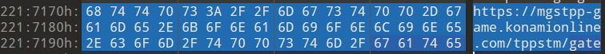
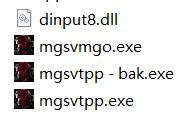
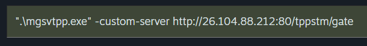
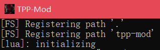

# Tutorials about MGSV:TPP custom server

<!-- vscode-markdown-toc -->
* 1. [How to connect a custom server rather than Konami's server ?](#HowtoconnectacustomserverratherthanKonamisserver)
	* 1.1. [Use hex editor to edit mgsvtpp.exe](#Usehexeditortoeditmgsvtpp.exe)
	* 1.2. [Use tpp-mod (recommend)](#Usetpp-modrecommend)
		* 1.2.1. [Compile the tpp-mod by yourself](#Compilethetpp-modbyyourself)
* 2. [How to set up my own server ?](#Howtosetupmyownserver)

<!-- vscode-markdown-toc-config
	numbering=true
	autoSave=true
	/vscode-markdown-toc-config -->
<!-- /vscode-markdown-toc -->

##  1. <a name='HowtoconnectacustomserverratherthanKonamisserver'></a>How to connect a custom server rather than Konami's server ?

###  1.1. <a name='Usehexeditortoeditmgsvtpp.exe'></a>Use hex editor to edit mgsvtpp.exe



    Change the website url here to your custom server's ip

    ```
    For example : https://http://26.104.88.212:80/tppstm/gate
    ```

    **Caution : do not break the binary address while editting the exe file, or the game will freeze at startup**

###  1.2. <a name='Usetpp-modrecommend'></a>Use tpp-mod (recommend)

Download the dll file here : [dinput8.dll](https://github.com/MXYLR/MXYLR.github.io/blob/master/MGSV-TPP-Server/dinput8.dll)

Move the `dinput8.dll` to your game folder :



Then add this to your steam launch options :

```
".\mgsvtpp.exe" -custom-server http://[your server ip]/tppstm/gate
```

You can also write a `.bat` file or add a shorcut or using cmd to do this.



Then open the game, you should see a popup window like this :



####  1.2.1. <a name='Compilethetpp-modbyyourself'></a>Compile the tpp-mod by yourself

Don't do this if you value your time.

Go to the project page :
https://github.com/alicealys/tpp-mod

```
git clone https://github.com/alicealys/tpp-mod
```

Then run the `generate.bat`, after then you should get a `.sln` file, open it with VS2022.

Then, compile it with VS2022.

After all, you should get the `dinput8.dll`.

##  2. <a name='Howtosetupmyownserver'></a>How to set up my own server ?

https://github.com/alicealys/tpp-server-emulator
